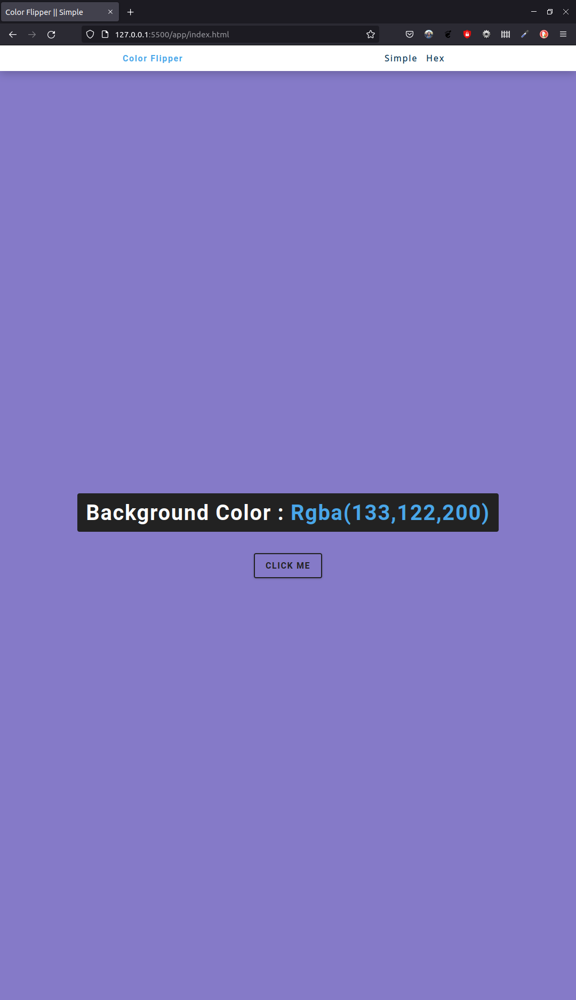
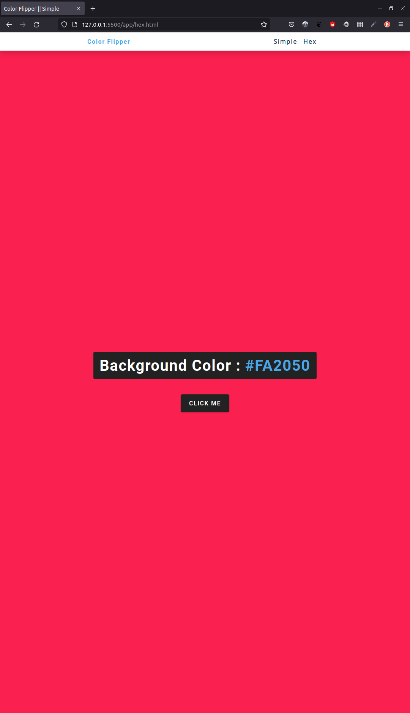

# Color flipper

## Description

This website lets you set its background color when you click the button.

In the "Simple" page, whenever you click the button, a color is randomly chosen from a specified set of colors.

In the "Hex" page, randomly generated color is one of the possible HEX colors.

## Screenshots

| Simple                                                  | HEX                                                  |
| ------------------------------------------------------- | ---------------------------------------------------- |
|  |  |

## Credits

The original project can be found here: [Build 15 JavaScript Projects - Vanilla JavaScript Course](https://youtu.be/3PHXvlpOkf4?t=421)
